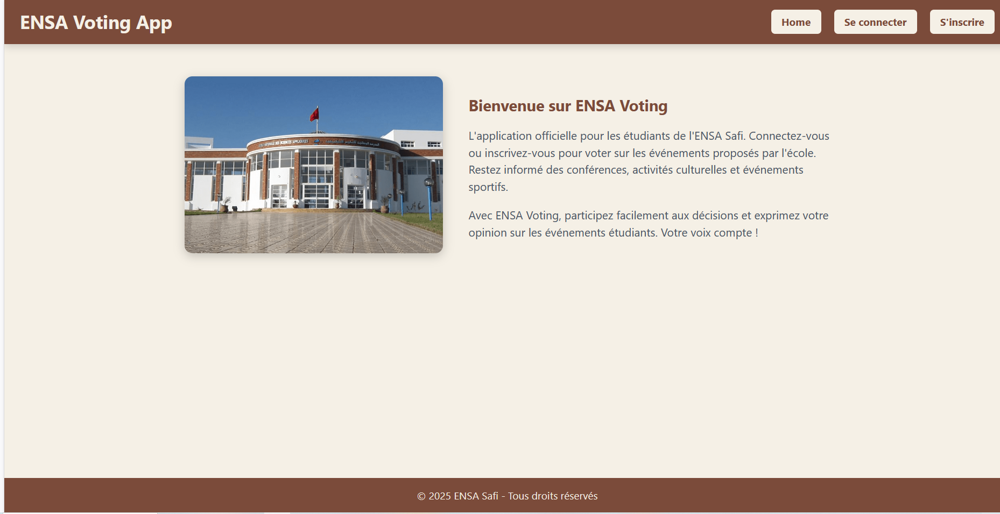

# ENSA Voting App

ENSA Voting est l'application officielle pour les étudiants de l'ENSA Safi. Elle permet de :  
- S'inscrire et se connecter.  
- Consulter les événements proposés par l'école.  
- Voter pour les événements de manière sécurisée.

---

## Déploiement

Le projet est déployé sur Firebase Hosting. Vous pouvez le consulter ici :  
[ENSA Voting App en ligne](https://ensa-safi-voting-b876d.web.app/)
